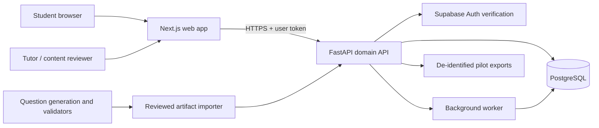

# ACT Adaptive Learning Platform V1 — Implementation Plan

## Document purpose

This document is the implementation plan for turning this repository into an adaptive ACT remediation product for English and Math.

The product is not a general test-prep website. Its job is to run one trustworthy loop:

> Diagnose a student's skill gaps → select the highest-value gap → direct the student to instruction → provide targeted practice → reassess with unseen material → update the skill estimate.

This plan stays at the platform level. It defines how official content, taxonomies, generated content, student responses, mastery estimates, recommendations, instruction, practice, reassessment, and experiments fit together. It intentionally does not prescribe how each individual official test must be allocated or tagged.

## Executive recommendation

Build V1 as a small, auditable learning system with four clear boundaries:

1. **The Next.js application** owns the student experience, authentication UI, and thin client-side interaction state.
2. **The FastAPI service** owns ACT content, assessment sessions, scoring, mastery updates, recommendations, practice assembly, and experiment data.
3. **PostgreSQL** is the system of record for versioned content, student responses, generated-item provenance, and mastery evidence.
4. **The generation pipeline** produces reviewed inventory outside the live student request path. V1 selects from approved questions; it does not make a student wait for an unreviewed model-generated item.

The recommended build sequence is:

1. Establish content and API contracts.
2. Prove a narrow English vertical slice end to end.
3. Expand English coverage while starting a narrow, high-value Math slice.
4. Add the complete practice/reassessment/mastery loop.
5. Instrument it for tutor comparison and learning-outcome experiments.
6. Expand coverage only when content and outcome evidence justify it.

The first usable version should look plain but be unusually inspectable. Every diagnosis must be traceable to responses. Every recommendation must be traceable to a versioned formula. Every generated item must be traceable to its generator run and reviews. Every mastery change must be reproducible.

---

## 1. Current repository reality

The repository is presently a foundation rather than an ACT product:

- Next.js 16.3.4 App Router, React 19, TypeScript, Tailwind CSS, and shadcn/ui are installed.
- Supabase browser/server clients and the Next.js 16 `proxy.ts` session-refresh pattern exist.
- PostgreSQL access is configured through Drizzle and `postgres.js`.
- The schema currently contains one generic `diagnostic_runs` table with JSONB input/result fields.
- The UI is a placeholder software-diagnostic landing page, not a student test-taking flow.
- Playwright has one starter smoke test.
- There is no FastAPI service, domain API, content importer, mastery engine, recommendation engine, or generated-question runtime integration in this repository.
- An adjacent question-generation project contains substantial English taxonomy, content-contract, validation, review, and generated-form work, plus Math taxonomy data. Its current metadata reports six English tests with 300 questions and 39 skills, and six Math tests with 270 questions and 133 skills. It is currently a workflow/tooling repository rather than a production API.
- The existing English source taxonomy describes distractor/failure mechanisms and does not automatically establish a single official primary skill for every source question. Diagnostic evidence mappings therefore require an explicit review layer rather than a blind import of source labels.
- Existing generated items have strong structural/review infrastructure but are not empirically calibrated or score-equivalent to official ACT items. The platform must preserve that distinction.

### Consequence for implementation

Do not incrementally stretch the generic `diagnostic_runs` JSONB record into the final domain. Replace it with explicit, auditable assessment and learning entities. JSONB should be reserved for versioned metadata, external generator payloads, and immutable calculation details—not for relationships that the application must query reliably.

### Repository rules that apply during implementation

- Use pnpm for package management and project scripts.
- Read the relevant installed Next.js guide in `node_modules/next/dist/docs/` before changing framework code.
- Finish one focused change, run the smallest relevant verification, stage explicit paths, and commit it before beginning the next change.
- Keep local credentials in `.env.local`; commit only safe variable names/placeholders in `.env.example`.
- Preserve unrelated worktree changes.

---

## 2. Product contract

### 2.1 Primary user outcome

After a diagnostic, a student should be able to answer all of these questions:

- Which three to five skills should I work on first?
- Why did the system select them?
- How certain is the system?
- What should I study for each skill?
- What practice should I complete next?
- Did I improve on new questions?
- What should I do now?

### 2.2 V1 student loop

```text
Start diagnostic
      ↓
Answer and autosave questions
      ↓
Submit section
      ↓
Score responses and create skill evidence
      ↓
Estimate mastery + uncertainty
      ↓
Rank 3–5 remediation targets
      ↓
Open one target and study linked instruction
      ↓
Complete 5–10 approved targeted practice items
      ↓
Complete a short unseen reassessment
      ↓
Update mastery and choose:
  ├─ advance to next target
  ├─ gather more evidence
  └─ repeat remediation with adjusted practice
```

### 2.3 V1 scope

V1 includes:

- English and Math as separate subjects sharing one platform architecture.
- Invite-only or otherwise limited student access.
- Diagnostic assessment delivery.
- Autosaved responses and resumable sessions.
- Explicit question-to-skill evidence mappings.
- A simple, versioned, replaceable mastery model.
- An explicit measure of uncertainty/evidence sufficiency.
- Prioritized remediation recommendations.
- Curated Khan Academy resource links.
- Approved generated practice inventory.
- Short reassessments using unseen items.
- Mastery updates based on new evidence.
- Minimal progress history focused on the active learning loop.
- Internal review, export, and issue-reporting tools needed to run a pilot.
- Analytics needed to test diagnosis and remediation quality.

### 2.4 Explicit non-goals

Do not build these before the core loop is validated:

- Reading or Science.
- A complete proprietary curriculum.
- An AI chat tutor.
- Live, unreviewed question generation during a student session.
- A visually elaborate dashboard.
- Parent, school, district, or licensing portals.
- Payment infrastructure.
- Social features, streaks, badges, or general gamification.
- A sophisticated spaced-repetition scheduler.
- High-stakes ACT score-equivalence claims for generated content.
- Full computer-adaptive testing or item-response-theory calibration.
- A generalized learning platform abstraction.

### 2.5 Product decision rule

For every proposed feature, ask:

> Does this make diagnosis, instruction selection, targeted practice, reassessment, or experimental validation materially better?

If not, defer it.

---

## 3. V1 hypotheses and success gates

V1 is an experiment platform. Engineering completion alone is not success.

### 3.1 Product hypotheses

| Hypothesis | Evidence needed | Failure signal |
| --- | --- | --- |
| Skill labels are actionable | Tutors agree that recommended skills describe teachable gaps | Recommendations are technically correct but too broad, too narrow, or not teachable |
| Diagnostic evidence is valid | Automated top weaknesses substantially overlap an independent tutor assessment | System repeatedly diagnoses skills the tutor cannot reproduce |
| Prioritization is useful | Students/tutors choose to work on the proposed top skills and can explain why | Students ignore the ranking or cannot distinguish priorities |
| Resource mapping is sufficient | Students can move from a diagnosed gap to relevant instruction without tutor translation | Khan links are unavailable, mismatched, or too broad |
| Generated practice measures the target | Reviewers accept items and students' distractor choices are interpretable | Items contain ambiguity, accidental difficulty, or off-skill distractors |
| Remediation transfers | Performance improves on unseen items measuring the same underlying skill | Practice accuracy rises but unseen reassessment does not |

### 3.2 Initial operating metrics

Use these as pilot operating thresholds, not scientific claims:

- **Content completeness:** every student-visible item has a correct answer, explanation, active skill mapping, provenance, and review status.
- **Evidence traceability:** every displayed mastery estimate can be recomputed from stored response evidence and a named model version.
- **Recommendation traceability:** every priority rank stores its component scores and formula version.
- **Session durability:** no accepted response is lost across refresh, navigation, or an interrupted session.
- **Diagnosis usefulness:** tutor comparison exports can report top-k agreement, disagreements, and insufficient-evidence cases.
- **Generator quality:** acceptance/rejection rate and rejection reasons are measurable by skill and generator version.
- **Learning transfer:** pre-practice evidence and unseen reassessment outcomes can be compared at the skill-cycle level.
- **Loop completion:** the funnel from diagnostic completion through at least one reassessment is measurable.

### 3.3 V1 release gate

Do not call the platform pilot-ready until all of the following are true:

- A student can complete the full loop without a developer editing the database.
- Content exposed to students is approved and can be traced to its source/review record.
- The platform distinguishes likely weakness from insufficient evidence.
- Practice items are never silently reused as reassessment items for the same student.
- A mastery update is deterministic and reproducible.
- A tutor can flag a diagnosis, resource, question, or explanation as problematic.
- Pilot data can be exported without exposing unnecessary student identity.
- The happy path and failure recovery path have end-to-end tests.

---

## 4. Recommended system architecture

### 4.1 High-level architecture



### 4.2 Responsibility boundaries

#### Next.js web application

Owns:

- Routes, layouts, rendering, form interaction, and accessibility.
- Authentication UI and session handoff.
- Local test-taking interaction state.
- Autosave requests and recovery UX.
- Student-facing display of results, resources, practice, and reassessment.
- Internal reviewer screens that are genuinely necessary for pilots.

Does not own:

- Mastery calculations.
- Priority calculations.
- Correct-answer authority.
- Question assembly rules.
- Generator credentials or prompts.
- Direct domain-table mutations from Client Components.

Use Server Components for page-level reads and small Client Components for interactive assessment behavior. Treat every Server Action or Route Handler as externally callable: authenticate, authorize, and validate inside the mutation itself. Because FastAPI is the domain backend, prefer one consistent external-HTTP-API approach over mixing direct Drizzle reads with API reads.

#### FastAPI domain service

Owns:

- Content retrieval and administrative imports.
- Assessment creation, item assignment, response persistence, submission, and scoring.
- Converting responses into skill evidence.
- Mastery calculation and snapshots.
- Remediation ranking and recommendation lifecycle.
- Practice/reassessment assembly and item-exposure rules.
- Generated-item ingestion and approval states.
- Experiment event recording and exports.
- Authorization for every domain operation.

Organize the service by domain rather than by technical layer alone:

```text
services/api/
  app/
    auth/
    content/
    assessments/
    mastery/
    recommendations/
    remediation/
    generation/
    analytics/
    common/
  migrations/
  tests/
  pyproject.toml
```

#### PostgreSQL

Owns the canonical state. Prefer immutable history and append-only evidence for anything needed to explain a student result.

Use relational columns for identifiers, statuses, ordering, ownership, foreign keys, timestamps, and frequently queried scoring fields. Use JSONB only for:

- A frozen generator request/response payload.
- Model calculation details needed for replay.
- Content structures that genuinely vary by item type.
- External resource metadata not used as a core relationship.

#### Background worker

Use a worker for generation imports, batch validation, mastery recomputation, exports, and other retryable work. V1 does not need a complex queue platform. Start with a PostgreSQL-backed job table and a separately runnable worker process, with:

- explicit job type;
- idempotency key;
- status and attempt count;
- scheduled/retry time;
- locked-at/locked-by fields;
- input and result metadata;
- structured error information.

Move to dedicated queue infrastructure only if observed volume or latency requires it.

### 4.3 API and authentication topology

Recommended request path:

1. Supabase authenticates the user.
2. Next.js obtains the current server-side session/token.
3. Next.js or the browser calls FastAPI with a short-lived bearer token.
4. FastAPI verifies token signature, issuer, audience, expiry, and user identity.
5. FastAPI performs resource-level authorization for every request.
6. FastAPI returns minimal response DTOs; answer keys never appear in active-session payloads.

Avoid relying on the Next.js route guard as authorization. A user who knows an ID must not be able to read or mutate another student's sessions.

### 4.4 Contract strategy

- FastAPI's OpenAPI document is the API source of truth.
- Generate a TypeScript API client or types from OpenAPI.
- Commit the generated contract only if CI checks that it is current; otherwise generate it during verification.
- Use explicit API versions, starting with `/v1`.
- Add contract tests for both success and error shapes.
- Keep mastery/recommendation model versions separate from API versions.
- Return stable machine-readable error codes plus safe human messages.

### 4.5 Deployment shape

Use independently deployable processes even if they remain in one repository:

- Next.js web deployment.
- FastAPI web process.
- Background worker process.
- Managed PostgreSQL/Supabase project.

The web app should receive only public Supabase configuration and the API base URL. Database credentials, auth verification configuration, model/provider credentials, and generator credentials remain server-only.

---

## 5. Domain model and database plan

### 5.1 Modeling principles

1. **Responses are facts; mastery is a derived opinion.** Never overwrite response history to make an estimate easier to store.
2. **Content is versioned.** Student history must continue to resolve to the exact question version shown.
3. **Exposure is explicit.** The system must know which items a student has seen and in what context.
4. **Evidence is directional and weighted.** A selected distractor can provide different evidence from a generic wrong answer.
5. **Models are replaceable.** Store model name/version and inputs needed to replay results.
6. **Operational states are explicit.** Draft, reviewed, approved, retired, running, submitted, scored, and failed should not be inferred from nullable fields.
7. **Privacy is minimized.** Domain tables reference the auth user ID and store only profile data needed for the pilot.

### 5.2 Core content entities

| Entity | Purpose | Important fields |
| --- | --- | --- |
| `subjects` | English/Math lookup | `id`, `slug`, `name`, `active` |
| `taxonomy_versions` | Freezes a coherent skill definition set | `id`, `subject_id`, `version`, `status`, `published_at`, `notes` |
| `skills` | Actionable skill nodes | `id`, `taxonomy_version_id`, `external_key`, `name`, `description`, `parent_id`, `importance_weight`, `active` |
| `skill_prerequisites` | Optional lightweight prerequisite links | `skill_id`, `prerequisite_skill_id`, `strength`, `reviewed` |
| `content_sources` | Provenance and permitted use | `id`, `source_type`, `name`, `version`, `rights_status`, `metadata` |
| `tests` | A source assessment/form container | `id`, `source_id`, `external_key`, `title`, `subject_id`, `profile`, `status` |
| `sections` | Ordered test sections | `id`, `test_id`, `subject_id`, `order`, `time_limit_seconds`, `status` |
| `passages` | Versioned English passage content | `id`, `source_id`, `external_key`, `version`, `content`, `metadata`, `status` |
| `questions` | Immutable question versions | `id`, `source_id`, `passage_id`, `external_key`, `version`, `stem`, `content`, `format`, `status`, `review_status` |
| `answer_choices` | Ordered display choices | `id`, `question_id`, `label`, `position`, `content`, `is_correct` |
| `question_skills` | Question-level measurement intent | `question_id`, `skill_id`, `role`, `evidence_weight`, `tag_source`, `tag_confidence`, `reviewed_by` |
| `choice_skill_evidence` | Misconception/failure evidence attached to a choice | `answer_choice_id`, `skill_id`, `direction`, `evidence_weight`, `failure_mode`, `rationale` |

`questions.content` can hold controlled item-type-specific structure such as underlined spans, Math notation blocks, figures, or accessibility text. Keep scoring authority in normalized choice/correctness fields.

### 5.3 Assessment and response entities

Use one assessment-session model with different purposes instead of separate nearly identical tables for diagnostics and reassessments.

| Entity | Purpose | Important fields |
| --- | --- | --- |
| `assessment_blueprints` | Versioned assembly rules | `id`, `subject_id`, `purpose`, `version`, `rules`, `status` |
| `assessment_sessions` | One student assessment event | `id`, `student_id`, `blueprint_id`, `purpose`, `status`, `started_at`, `submitted_at`, `scored_at`, `model_context` |
| `assessment_session_items` | Frozen ordered item assignment | `id`, `session_id`, `question_id`, `position`, `section_position`, `assigned_at`, `exposure_role` |
| `responses` | Latest accepted response state | `id`, `session_item_id`, `student_id`, `answer_choice_id`, `response_content`, `is_omitted`, `client_revision`, `first_viewed_at`, `answered_at`, `time_spent_ms`, `self_reported_confidence`, `saved_at` |
| `response_events` | Append-only answer/change audit | `id`, `response_id`, `event_type`, `payload`, `occurred_at` |
| `item_exposures` | Prevents inappropriate reuse | `student_id`, `question_id`, `session_id`, `purpose`, `first_seen_at`, `answered_at` |
| `session_scores` | Reproducible section summary | `session_id`, `raw_correct`, `raw_total`, `score_details`, `scoring_version`, `created_at` |

Key requirements:

- `assessment_session_items` is immutable after a student begins.
- Autosave uses a monotonic `client_revision` or idempotency key so stale requests cannot overwrite newer answers.
- Active-session APIs never return `is_correct`, correct-choice IDs, answer explanations, or other answer-key metadata.
- Submission is idempotent and transactional.
- Scoring reads the frozen assigned question versions, not the current live content record.

### 5.4 Mastery and recommendation entities

| Entity | Purpose | Important fields |
| --- | --- | --- |
| `mastery_evidence` | One response's contribution to one skill | `id`, `student_id`, `skill_id`, `response_id`, `direction`, `weight`, `source_purpose`, `model_version`, `details` |
| `mastery_snapshots` | Student-skill estimate at a point in time | `id`, `student_id`, `skill_id`, `mean`, `lower_bound`, `upper_bound`, `effective_evidence`, `classification`, `model_version`, `calculated_at` |
| `recommendation_runs` | A reproducible ranking operation | `id`, `student_id`, `trigger_session_id`, `formula_version`, `inputs`, `created_at` |
| `recommendations` | Ranked target skills | `id`, `run_id`, `skill_id`, `rank`, `priority_score`, `weakness_score`, `importance_score`, `confidence_score`, `status`, `explanation` |

Do not store mastery as a single mutable percentage with no history. The latest estimate can be cached for fast reads, but the evidence and snapshots must remain available.

### 5.5 Remediation entities

| Entity | Purpose | Important fields |
| --- | --- | --- |
| `learning_resources` | Curated external instruction | `id`, `skill_id`, `provider`, `title`, `url`, `resource_type`, `level`, `status`, `last_verified_at` |
| `remediation_cycles` | One diagnose-to-reassess unit | `id`, `student_id`, `skill_id`, `recommendation_id`, `status`, `baseline_snapshot_id`, `started_at`, `completed_at` |
| `resource_events` | Measures use without claiming learning | `id`, `cycle_id`, `resource_id`, `event_type`, `occurred_at` |
| `practice_sets` | Frozen approved practice assignment | `id`, `cycle_id`, `status`, `target_count`, `assembly_version`, `created_at`, `completed_at` |
| `practice_set_items` | Ordered question assignment | `practice_set_id`, `question_id`, `position` |
| `reassessment_links` | Connects the cycle to its reassessment | `cycle_id`, `assessment_session_id`, `attempt_number` |

The cycle state machine should be explicit:

```text
recommended → learning → practicing → ready_to_reassess
→ reassessing → mastered | repeat_recommended | needs_more_evidence | abandoned
```

### 5.6 Generated-content entities

| Entity | Purpose | Important fields |
| --- | --- | --- |
| `generation_runs` | Reproducible batch/request record | `id`, `subject_id`, `skill_id`, `generator_version`, `model`, `prompt_version`, `request`, `status`, `cost`, `started_at`, `completed_at` |
| `generated_candidates` | Raw candidate before acceptance | `id`, `run_id`, `external_key`, `payload`, `machine_status`, `review_status`, `rejection_reasons` |
| `content_reviews` | Human/machine review evidence | `id`, `candidate_id` or `question_id`, `reviewer_id`, `review_type`, `verdict`, `rubric_version`, `findings`, `created_at` |
| `generator_metrics` | Aggregated operational quality | `run_id`, `candidate_count`, `accepted_count`, `rejected_count`, `metrics` |

Accepted generated candidates are transformed into canonical `questions`, `answer_choices`, and skill-evidence rows. The canonical item stores a pointer back to its candidate and generation run.

### 5.7 Analytics entities

Use domain tables as the source of truth and add a narrow event stream for interaction analysis:

| Entity | Purpose | Important fields |
| --- | --- | --- |
| `analytics_events` | Product interaction/funnel events | `id`, `student_id`, `anonymous_session_id`, `event_name`, `entity_type`, `entity_id`, `properties`, `occurred_at` |
| `issue_reports` | Tutor/student content or diagnosis flags | `id`, `reporter_id`, `entity_type`, `entity_id`, `category`, `description`, `status`, `resolution` |
| `experiment_assignments` | Stable pilot/cohort configuration | `id`, `student_id`, `experiment_key`, `variant`, `assigned_at` |
| `tutor_skill_assessments` | Independent pre-result tutor judgment for validation | `id`, `student_id`, `tutor_id`, `subject_id`, `taxonomy_version_id`, `skill_id`, `rating`, `rank`, `confidence`, `sealed_at`, `revealed_at` |

Do not duplicate answer facts or mastery facts only as analytics events. Events are for sequence, funnel, and UX context.

### 5.8 Migration strategy from `diagnostic_runs`

The existing table contains no meaningful production data contract yet. Handle it with a focused migration:

1. Confirm whether it contains data in any shared environment.
2. If empty, replace it after the new assessment tables exist.
3. If non-empty, retain it as `legacy_diagnostic_runs` or write a one-time migration with an audit report.
4. Stop all new writes to the JSONB model once assessment sessions are available.
5. Let the FastAPI migration tool own domain-schema evolution after the backend boundary is established.

Avoid maintaining competing Drizzle and Python definitions for the same domain tables. Pick one migration owner. The recommended default is FastAPI's Python persistence layer and migration tooling for domain data; Next.js consumes the API and keeps only auth/web-specific helpers.

---

## 6. Content and taxonomy pipeline

### 6.1 Content lifecycle

```text
Source artifact
  → schema validation
  → canonical normalization
  → taxonomy/version resolution
  → evidence-map review
  → rights/provenance check
  → import preview/diff
  → idempotent import
  → approved inventory
  → assignment to a student
  → response evidence and item statistics
  → revise/version/retire decision
```

### 6.2 Taxonomy requirements

Each active skill needs:

- Stable external key.
- Student-facing name.
- Tutor/content-author definition.
- Inclusion and exclusion guidance.
- Parent category.
- Subject.
- Importance/frequency weight with provenance.
- Examples and close-case notes.
- Evidence rules for correct and incorrect responses.
- Resource mappings.
- Supported practice/reassessment inventory counts.
- Taxonomy version and lifecycle state.

### 6.3 Tagging model

A flat many-to-many `QuestionSkill` mapping is necessary but not sufficient. V1 should distinguish:

- **Primary skill:** the intended construct the item most directly measures.
- **Secondary skill:** a skill that materially affects the item but should receive less or no evidence.
- **Distractor-linked failure mode:** a specific misconception suggested by choosing a particular wrong answer.
- **Uncertain tag:** a provisional classification that is not eligible for high-confidence diagnosis.

For each item, reviewers should answer:

1. What exact student decision makes the correct answer correct?
2. Does a correct response support the primary skill, or could it be obtained through another route?
3. What does each wrong choice suggest?
4. Is the item too multi-skill to support targeted diagnosis?
5. How much evidence should this item contribute?

### 6.4 Review workflow

Use a lightweight but auditable content workflow:

1. Importer creates a draft item and proposed mappings.
2. First reviewer checks correctness, clarity, and primary skill.
3. Second reviewer checks target-skill purity and distractors for student-visible generated content.
4. Disagreement creates an adjudication task.
5. Approved versions become assignable.
6. Any later text, choices, answer key, explanation, or evidence-map change creates a new version.
7. Existing student sessions continue referencing the old version.

The application may begin with review records imported from the generator project and a CLI/report workflow. Build an admin UI only for high-frequency review tasks that slow the pilot.

### 6.5 Importer requirements

The importer must:

- Validate input against versioned schemas.
- Produce a dry-run summary before writing.
- Use stable external IDs and idempotent upserts.
- Never mutate a version already exposed to students.
- Verify all skill keys and parent relationships.
- Verify answer-choice completeness and exactly one correct response when appropriate.
- Verify passage/target references and offsets where applicable.
- Reject unresolved review or provenance states.
- Record the import batch, source hash, schema version, warnings, and row counts.
- Support rollback by deactivating an import batch rather than deleting student history.

### 6.6 Official content and rights gate

Before putting official content in a student-facing environment:

- Record source and version.
- Confirm what use, reproduction, storage, and display are authorized.
- Separate internal analysis assets from publishable content.
- Restrict raw content access to the minimum required roles.
- Do not place protected assessment text in client bundles, logs, analytics payloads, or public fixtures.
- Add product/legal review for ACT and Khan Academy naming, attribution, links, and trademarks.

This is a release gate, not a later cleanup item.

---

## 7. Diagnostic engine

### 7.1 Diagnostic blueprint

A diagnostic blueprint should specify platform-level rules rather than hardcoded question IDs in UI code:

- Subject and assessment profile.
- Eligible content pools/statuses.
- Target skill coverage.
- Item count and time behavior.
- Ordering/passage grouping constraints.
- Exclusion rules.
- Exposure/reuse policy.
- Scoring version.
- Mastery model version.
- Blueprint version and publish state.

Blueprint publication should validate that enough approved content exists to meet its rules. Once a session starts, its item assignments are frozen.

### 7.2 Session behavior

Required states:

```text
created → in_progress → submitted → scoring → scored
                  └→ expired
                  └→ abandoned
                              scoring └→ failed/retryable
```

Required student behavior:

- Start once; repeated start requests return the same open session when appropriate.
- Resume on another page load/device after authentication.
- Autosave each change.
- Show save state without distracting from testing.
- Navigate among allowed questions.
- Show unanswered count before final submission.
- Confirm final submission.
- Prevent answer changes after submission.
- Recover gracefully from temporary API failures.
- Support keyboard use, zoom, screen readers, and Math accessibility text.

### 7.3 Autosave protocol

For every response mutation:

- Client sends `session_item_id`, selected response, a client revision, and an idempotency key.
- API validates ownership, session status, and that the choice belongs to the assigned question.
- API accepts only revisions newer than the stored revision.
- API records the current response plus an append-only response event.
- API returns the authoritative saved revision/time.
- Client retries transient failures using the same idempotency key.
- A stale tab receives a conflict response instead of overwriting newer work.

### 7.4 Submission and scoring

Submission should occur in one transaction or resumable workflow:

1. Lock the session for submission.
2. Freeze unanswered items as omissions.
3. Mark `submitted_at`.
4. Score against assigned item versions.
5. Create response-to-skill evidence.
6. Compute mastery snapshots.
7. Run prioritization.
8. Mark the session scored.
9. Emit domain/analytics events.

If steps after submission fail, the session remains submitted and a retry safely resumes from the missing stage. Repeated submission requests must not duplicate evidence.

The skill profile is the primary output. A scaled ACT score is optional in V1. If one is displayed, it must come from an applicable authorized scoring table tied to the exact assessment profile and scoring version. Never derive or imply an official ACT-equivalent score from generated practice or reassessment items.

---

## 8. Mastery model V1

### 8.1 Goals

The first model should be:

- Understandable to the founder and tutors.
- Stable with sparse evidence.
- Able to represent uncertainty.
- Able to weight primary, secondary, and distractor-specific evidence differently.
- Deterministic and easy to test.
- Replaceable without rewriting response history.

It should not claim full psychometric calibration.

### 8.2 Recommended initial model: weighted Beta-Binomial

For each student and skill, maintain two positive parameters:

```text
alpha = prior positive evidence + weighted successful evidence
beta  = prior negative evidence + weighted unsuccessful evidence

estimated mastery = alpha / (alpha + beta)
```

Recommended behavior:

- Begin with a weak, explicit prior shared within a subject or skill family.
- A correct primary-skill response adds positive weight.
- A wrong response adds negative weight to the primary skill only when the item supports that inference.
- A selected misconception-linked distractor adds stronger, targeted negative evidence to its linked skill/failure mode.
- Secondary tags contribute a smaller configured weight or no weight.
- Practice and reassessment can use different evidence multipliers.
- Reassessment evidence should generally be more influential than coached practice evidence.
- Omitted/time-expired items are stored separately; do not automatically treat them as identical to attempted incorrect responses without a stated policy.

### 8.3 Uncertainty and evidence sufficiency

Compute and store:

- Posterior mean.
- Lower and upper credible bounds.
- Effective evidence count/weight.
- Correct, incorrect, omitted, and distractor-specific counts.
- Classification reason.

Student-facing classifications should be categorical and honest:

- `strong_evidence_of_mastery`
- `likely_mastered`
- `developing`
- `likely_weak`
- `strong_evidence_of_weakness`
- `insufficient_evidence`

Do not display a precise percentage without context when evidence is sparse. A result should be able to say, “This may be a weakness, but we need more evidence,” rather than presenting 0% mastery from one item.

### 8.4 Evidence policy table

Create a versioned configuration rather than burying weights in code:

| Evidence situation | Direction | Relative weight | Notes |
| --- | --- | --- | --- |
| Correct, clean primary-skill item | Positive | High | Strongest when alternate solution paths are limited |
| Incorrect with target-linked distractor | Negative | High | Supports a specific failure mode |
| Incorrect without diagnostic distractor | Negative | Medium | Less specific |
| Multi-skill item | Positive/negative | Low or none | Avoid double-counting confounded evidence |
| Guided practice correct | Positive | Low | May reflect immediate support |
| Guided practice incorrect | Negative | Low/medium | Useful for choosing more practice, not a final verdict |
| Unseen reassessment correct | Positive | High | Best V1 evidence of transfer |
| Omitted/time-expired | Separate | Policy-driven | Could reflect speed, disengagement, or skill |

Exact weights and thresholds are configuration decisions to be tested with pilot data.

### 8.5 Mastery engine interface

The engine should expose pure functions where possible:

```text
response + item evidence map + policy version
  → zero or more mastery evidence records

prior snapshot + ordered evidence + model version
  → new mastery snapshot
```

Tests must cover:

- No evidence.
- One correct/incorrect response.
- Repeated evidence.
- Mixed evidence.
- Multi-skill questions.
- Distractor-specific evidence.
- Omission policy.
- Practice vs reassessment weights.
- Idempotent recomputation.
- Historical replay after a model-version change.

### 8.6 Model evolution path

Only after enough response data exists, consider:

- Empirical item difficulty/facility.
- Item discrimination.
- Hierarchical priors by skill family.
- Time/speed features.
- Prerequisite propagation.
- Bayesian knowledge tracing or IRT-family models.
- Calibration checks across demographic groups.

The stored raw responses, item versions, exposures, and evidence links should make this evolution possible without changing V1's student workflow.

---

## 9. Weakness prioritization

### 9.1 V1 priority formula

Rank only active skills with sufficient content support. A transparent starting formula is:

```text
weakness = normalized gap below target mastery
importance = normalized ACT frequency/score-impact proxy
confidence = function of evidence amount and posterior interval width
readiness = 1 if instruction + practice + reassessment inventory are available, else 0

priority = weakness × importance × confidence × readiness
```

Keep every component and the formula version in `recommendations`.

### 9.2 Handling sparse evidence

Sparse low performance should often produce a **confirmatory recommendation**, not immediate remediation:

- If weakness is large but confidence is low, request a few additional diagnostic items.
- If weakness and confidence are high, recommend remediation.
- If evidence conflicts, classify as developing/uncertain and gather targeted evidence.
- If a skill has no approved learning/practice/reassessment path, do not present it as immediately actionable; surface it internally as a coverage gap.

### 9.3 Ranking rules

- Show approximately three to five current targets.
- Avoid showing both a broad parent and its child skill as separate simultaneous targets.
- Prefer the most actionable supported node.
- Use deterministic tie-breaking.
- Store but do not necessarily display lower-ranked targets.
- Recompute after a diagnostic and after each reassessment, not after every guided-practice click.
- Never silently change an active remediation cycle's target because a new formula version was deployed.

### 9.4 Student-facing explanation

For each recommendation, generate explanation text from structured facts, not an LLM:

```text
Sentence boundaries is a high-priority area because:
- your recent answers show repeated difficulty;
- this skill appears often enough to matter;
- the system has enough evidence to recommend focused work.
```

Also show an uncertainty sentence when appropriate.

---

## 10. Instruction-resource layer

### 10.1 Resource mapping workflow

For every supported skill:

1. Identify the narrow learning objective.
2. Select the most relevant Khan Academy lesson, article, exercise, or video.
3. Record whether the mapping is exact, partial, prerequisite, or enrichment.
4. Add a short “what to focus on” note.
5. Verify the link and content manually.
6. Record review date and reviewer.
7. Recheck links on a scheduled basis.

### 10.2 Student experience

The learning page should include only:

- Skill name and plain-language diagnosis.
- A concise explanation of what the skill means.
- Why it was prioritized.
- One recommended primary resource and optional alternative.
- A “what to notice” prompt.
- Continue-to-practice action.
- Report-a-problem action.

Do not imply that opening or watching a resource proves learning. Resource events are engagement evidence only.

### 10.3 Resource availability policy

If Khan Academy does not map cleanly:

- Link the closest prerequisite and explicitly label the limitation.
- Add a short founder-authored bridge note only when needed.
- Mark the skill as partially supported.
- Do not create a complete lesson-production project for V1.

---

## 11. Generated targeted practice

### 11.1 V1 operating model

The runtime contract can accept a request such as:

```json
{
  "subject": "math",
  "skill_key": "function_notation",
  "difficulty_target": "medium",
  "count": 8,
  "failure_mode": "translate_notation",
  "generator_contract_version": "1"
}
```

However, V1 should normally satisfy that request from an approved item bank. Generation and review happen asynchronously before assignment.

This reduces four risks:

- student-visible invalid items;
- unpredictable latency;
- model/provider failure during study;
- inability to review the exact item before it affects mastery.

### 11.2 Canonical generated-item contract

Every candidate needs:

- Stable candidate ID.
- Subject and requested skill.
- Optional failure mode/misconception.
- Stem and item-type-specific content.
- Ordered answer choices where appropriate.
- Correct answer.
- Student-facing explanation.
- Rationale for every distractor.
- Primary and secondary skill tags.
- Authoring complexity target.
- Estimated difficulty label clearly distinguished from empirical difficulty.
- Generator version, prompt/context version, model/provider, parameters, and seed when available.
- Source/context references needed for review.
- Machine-validation results.
- Human-review records.
- Final acceptance/rejection status and reasons.

### 11.3 Quality gates

A generated item cannot enter student inventory until it passes:

1. Schema and structural validation.
2. Answer-key consistency.
3. Mathematical/grammatical correctness.
4. Unique-best-answer review.
5. Target-skill purity review.
6. Distractor plausibility and diagnostic-value review.
7. Explanation accuracy.
8. Accessibility/rendering review.
9. Originality/provenance checks appropriate to the item type.
10. Final display review using the same renderer students will see.

Machine checks can reject obvious failures; they do not establish instructional validity.

### 11.4 English-specific platform needs

The platform must support:

- Passage-bound questions.
- Immutable passage versions.
- Tested spans and exact offsets.
- Underlined/replacement text presentation.
- Passage-level grouping during practice.
- Rhetorical questions requiring wider passage context.
- Answer-position overlays without changing the underlying semantic alternatives.

The assembler must not treat every English micro-skill as independently generatable without passage context. Inventory readiness is measured at the assignable set level.

### 11.5 Math-specific platform needs

The platform must support:

- Accessible mathematical notation.
- Equations and structured expressions.
- Figures/diagrams with alt text.
- Units and exact/approximate answers.
- Multiple valid solution paths in explanations.
- Symbolic equivalence checks in generation QA where relevant.
- Calculator-policy metadata where relevant to the selected assessment profile.

Use a restricted, sanitized math-rendering format rather than arbitrary generated HTML.

### 11.6 Inventory policy

For every skill exposed as remediable, define minimum inventory requirements:

- Enough approved practice items for more than one attempt.
- Enough unseen reassessment items.
- No practice/reassessment overlap for a student.
- A mix of surface forms so memorization does not masquerade as transfer.
- Coverage of known failure modes where the taxonomy supports them.

If inventory falls below the threshold, the system should stop assigning the skill and create an internal content task.

### 11.7 Generation observability

Track by skill and generator version:

- Candidates requested/generated.
- Machine-validation failure rate.
- Human acceptance rate.
- Rejection reasons.
- Reviewer agreement.
- Cost and latency.
- Post-release issue rate.
- Student item facility and distractor selection once enough data exists.

---

## 12. Practice and reassessment engine

### 12.1 Practice assembly

When a remediation cycle begins:

1. Load the target skill, failure mode if known, and current mastery snapshot.
2. Confirm instruction and inventory readiness.
3. Exclude previously exposed items according to policy.
4. Select a small approved set matching skill and suitable complexity.
5. Freeze item order and versions.
6. Deliver immediate answer feedback and explanation after each practice response.
7. Record attempts as practice evidence with reduced weight.
8. Offer additional practice or reassessment based on completion and performance rules.

### 12.2 Feedback policy

Practice may show:

- Correct/incorrect state.
- Correct answer.
- Explanation.
- Why the selected distractor fails when available.
- A retry or similar example.

Diagnostic and reassessment sessions must not expose correctness until submission.

### 12.3 Reassessment assembly

Reassessment should:

- Use unseen approved items.
- Target the same underlying skill, not identical wording or memorized structure.
- Remain short enough to complete immediately after remediation.
- Freeze its item versions.
- Avoid practice feedback until final submission.
- Contribute stronger mastery evidence than guided practice.

### 12.4 Cycle outcome rules

Define versioned rules for:

- `mastered`: reassessment and posterior evidence clear the target threshold with sufficient confidence.
- `repeat_recommended`: evidence remains weak with sufficient confidence.
- `needs_more_evidence`: estimate is inconclusive.
- `advance`: close cycle and recompute priorities.

Avoid a single perfect short reassessment automatically producing permanent mastery. Likewise, one poor short reassessment should not erase a substantial history. The model combines evidence and reports uncertainty.

### 12.5 Repeated cycles

On repeat:

- Do not reuse already seen reassessment items.
- Prefer a different instructional resource or focus note if available.
- Prefer practice targeting the observed failure mode.
- Store attempt number and prior outcome.
- Escalate internally when the platform lacks inventory or the skill may be misdiagnosed.

---

## 13. Student and internal UX plan

### 13.1 Route map

Recommended App Router organization:

```text
src/app/
  (public)/
    page.tsx
    sign-in/page.tsx
  (student)/
    layout.tsx
    start/page.tsx
    diagnostic/[sessionId]/page.tsx
    results/[sessionId]/page.tsx
    learn/[cycleId]/page.tsx
    practice/[setId]/page.tsx
    reassess/[sessionId]/page.tsx
    progress/page.tsx
  (internal)/
    review/page.tsx
    issues/page.tsx
    experiments/page.tsx
```

Route groups organize layouts without changing URLs. Add route-level `loading.tsx`, `error.tsx`, and `not-found.tsx` where recovery matters.

### 13.2 Page responsibilities

#### Start

- Explain the process and expected time.
- Let the student choose an available subject/diagnostic.
- Resume an unfinished session.
- Avoid marketing/dashboard clutter.

#### Diagnostic player

- Passage/figure panel where needed.
- Question and answer choices.
- Progress and unanswered count.
- Navigation controls.
- Time display only when the selected diagnostic policy requires it.
- Save-state indicator.
- Accessible keyboard/focus behavior.

#### Results

- Plain-language diagnostic summary.
- Three to five ranked target skills.
- Mastery band and evidence sufficiency, not unsupported precision.
- Why each skill matters.
- Start-remediation action.
- Small secondary section for “we need more evidence.”

#### Learn

- One target skill.
- Diagnosis explanation.
- Curated instruction link(s).
- Focus note.
- Continue-to-practice action.

#### Practice

- Small item set.
- Immediate feedback.
- Explanations and misconception-specific notes.
- Progress toward the set, not gamification.

#### Reassess

- Clear statement that these are new questions.
- No answer feedback until submission.
- Outcome that explains whether mastery changed, remained uncertain, or needs another cycle.

#### Minimal progress

- Completed remediation cycles.
- Current priority targets.
- Changes in mastery bands over time.
- Continue-current-cycle action.

### 13.3 Internal pilot tools

Build only what reduces experimental friction:

- Search a student by pilot identifier.
- View response-backed skill evidence.
- Compare current recommendation with tutor assessment.
- Flag incorrect tags, broken resources, invalid questions, or misleading explanations.
- Review generation/import status.
- Export de-identified pilot data.

Do not turn this into a full tutor dashboard in V1.

### 13.4 Design principles

- Optimize for sustained reading and question answering.
- Make autosave and session state trustworthy but quiet.
- Use color plus text/icon state; never color alone.
- Preserve question layout at 200% zoom.
- Support keyboard-only completion.
- Add reduced-motion behavior.
- Ensure Math notation and English annotations have screen-reader alternatives.
- Test narrow mobile layouts, but optimize the serious assessment experience for tablet/laptop widths.

---

## 14. API surface

The exact payloads belong in OpenAPI, but the initial resource surface should be approximately:

### 14.1 Student/session endpoints

```text
GET    /v1/me
GET    /v1/diagnostics
POST   /v1/assessment-sessions
GET    /v1/assessment-sessions/{session_id}
PUT    /v1/assessment-sessions/{session_id}/responses/{session_item_id}
POST   /v1/assessment-sessions/{session_id}/submit
GET    /v1/assessment-sessions/{session_id}/results
```

### 14.2 Recommendation/remediation endpoints

```text
GET    /v1/recommendations/current
POST   /v1/remediation-cycles
GET    /v1/remediation-cycles/{cycle_id}
POST   /v1/remediation-cycles/{cycle_id}/resource-events
POST   /v1/remediation-cycles/{cycle_id}/practice-sets
GET    /v1/practice-sets/{set_id}
PUT    /v1/practice-sets/{set_id}/responses/{item_id}
POST   /v1/practice-sets/{set_id}/complete
POST   /v1/remediation-cycles/{cycle_id}/reassessments
```

### 14.3 Minimal history endpoints

```text
GET    /v1/mastery
GET    /v1/mastery/{skill_id}/history
GET    /v1/remediation-cycles
```

### 14.4 Internal endpoints

```text
POST   /v1/internal/imports/preview
POST   /v1/internal/imports
GET    /v1/internal/generation-runs
POST   /v1/internal/content/{content_id}/reviews
POST   /v1/internal/issues
GET    /v1/internal/experiments/{experiment_key}/export
```

### 14.5 API behavior standards

- All mutations accept an idempotency key where retries are plausible.
- List endpoints use stable cursor pagination.
- Timestamps are UTC ISO 8601.
- IDs are opaque UUIDs.
- Validation errors identify safe field-level issues.
- Authorization failures do not reveal whether another user's resource exists.
- Active-item responses omit all scoring secrets.
- Result payloads include calculation/model versions.
- Trace/request IDs appear in responses and structured logs.

---

## 15. Analytics and experimental design

### 15.1 Event vocabulary

Start with a controlled list:

```text
diagnostic_started
response_saved
diagnostic_resumed
diagnostic_submitted
diagnostic_scored
results_viewed
recommendation_viewed
remediation_started
resource_opened
practice_started
practice_answered
practice_completed
reassessment_started
reassessment_submitted
remediation_completed
remediation_repeat_recommended
issue_reported
```

Every event definition should document:

- When it fires.
- Required properties.
- Prohibited sensitive properties.
- Deduplication key.
- Owning domain entity.

### 15.2 Diagnostic-validation study

The platform should support this workflow without manual database repair:

1. Enroll a small pilot cohort under a named experiment.
2. Record the tutor's independent predicted weaknesses before results are revealed.
3. Have the student complete a diagnostic.
4. Freeze the automated recommendation run.
5. Compare top-k overlap and inspect disagreements.
6. Categorize failures as taxonomy, tagging, sparse evidence, model, or tutor disagreement.
7. Do not retroactively alter the frozen run; create a new model/tag version for reanalysis.

### 15.3 Remediation-validation study

For each completed skill cycle, export:

- Baseline mastery snapshot and evidence.
- Recommended skill and priority components.
- Instruction resource exposure.
- Practice items, responses, timing, and feedback exposure.
- Reassessment items and responses.
- Updated mastery snapshot.
- Tutor/student issue flags.
- Item and model versions.

Primary early analysis:

- Change on unseen same-skill items.
- Proportion of cycles classified mastered/repeat/uncertain.
- Improvement by skill and item family.
- Cases where practice improved but reassessment did not.
- Attrition at each step in the loop.

### 15.4 Interpretation rules

- Treat the initial cohort as product discovery, not efficacy proof.
- Report counts and uncertainty, not only percentages.
- Separate question-level improvement from student-level conclusions.
- Do not pool incompatible skill definitions or content versions without labeling them.
- Do not interpret resource clicks as learning.
- Do not interpret generated practice performance as transfer.
- Preserve negative findings; they are the main input to taxonomy and generator improvement.

---

## 16. Security, privacy, safety, and content integrity

### 16.1 Authentication and authorization

- Use a minimal Supabase Auth flow, preferably invite-only for the pilot.
- Keep roles minimal: student, tutor/reviewer, admin.
- Verify FastAPI authorization on every object access.
- Use row-level security as defense in depth if direct Supabase access remains anywhere.
- Never trust a client-provided student ID, score, correct-answer state, skill, or role.

### 16.2 Student privacy

- Store only the profile fields needed to run the pilot.
- Use a pilot ID in exports instead of name/email.
- Document retention and deletion behavior.
- Restrict raw response and tutor-assessment exports.
- Review consent requirements, especially for minors.
- Keep free-text collection minimal.
- Do not put student answers or identifiers in model prompts unless explicitly required and approved.

### 16.3 Answer-key protection

- Never send answer keys before diagnostic/reassessment submission.
- Do not expose them in static bundles, page source, analytics, or error messages.
- Log question IDs rather than full protected content.
- Rate-limit suspicious bulk content access.
- Keep internal import/review endpoints role-protected.

### 16.4 Generator safety

- Keep provider credentials server-only.
- Version prompts and validation rules.
- Sanitize generated rich content.
- Do not render arbitrary HTML/JavaScript.
- Record provider/model changes.
- Require review after any generator/prompt version change before new inventory is assignable.

### 16.5 Operational controls

- Automated database backups and tested restore procedure.
- Structured application logs without assessment content or student PII.
- Error monitoring with payload scrubbing.
- Health/readiness endpoints for API and worker.
- Migration backups and rollback instructions.
- Feature flags for new mastery and recommendation versions.

---

## 17. Testing and verification strategy

### 17.1 Test pyramid

#### Pure unit tests

High coverage for:

- Response validation.
- Scoring.
- Evidence generation.
- Mastery calculations.
- Credible interval/classification rules.
- Priority formula.
- Item exposure filtering.
- Practice/reassessment outcome rules.
- Import normalization.

#### Database/integration tests

Cover:

- Migrations from an empty database.
- Idempotent imports.
- Foreign keys and unique constraints.
- Concurrent/stale autosave.
- Idempotent submission.
- Recompute without duplicate mastery evidence.
- Authorization/resource ownership.
- Worker retry and job locking.

#### Contract tests

Cover:

- OpenAPI generation.
- TypeScript client compatibility.
- Error DTOs.
- No answer-key leakage in active-session responses.
- Backward-compatible changes within `/v1`.

#### Component/accessibility tests

Cover:

- Question types and choice interaction.
- Passage layout.
- Math rendering.
- Keyboard navigation and focus.
- Save/retry/error states.
- Results with high, low, and insufficient evidence.

#### Playwright end-to-end tests

Minimum flows:

1. Sign in/start/resume a diagnostic.
2. Answer, reload, and confirm autosaved state.
3. Submit and view prioritized results.
4. Start a remediation cycle, open a resource, and finish practice.
5. Finish reassessment and see mastery/recommendations update.
6. Simulate API save failure and recover without answer loss.
7. Confirm one student cannot access another student's session.
8. Confirm reassessment does not reuse exposed practice items.

### 17.2 Content tests

- Schema validation for every imported artifact.
- Referential checks for skills, passages, choices, and sources.
- Exactly one correct choice where required.
- Target offset/render checks for English.
- Math expression/figure rendering snapshots.
- Review-status enforcement.
- Broken-link monitoring for resources.
- Inventory sufficiency report by skill and purpose.

### 17.3 CI stages

Extend CI incrementally:

```text
pnpm lint
pnpm typecheck
pnpm test:unit
pnpm api:lint
pnpm api:typecheck
pnpm api:test
pnpm contracts:check
pnpm content:validate
pnpm build
pnpm test:e2e
```

All project entry points should be exposed as pnpm scripts even when they invoke Python tooling, so local and CI workflows remain consistent.

### 17.4 Definition of verified change

For each focused implementation change:

1. Run the smallest relevant check.
2. Inspect the diff.
3. Stage only explicit paths.
4. Commit the focused change.
5. Record follow-up work in the next focused commit rather than mixing concerns.

---

## 18. Phased delivery roadmap

The phases below are ordered by dependency and learning value. Estimates should be made after content/API contract review and should be treated as capacity ranges, not deadlines.

### Phase 0 — Resolve foundational decisions

#### Goal

Remove decisions that would otherwise cause schema or service rewrites.

#### Work

- [ ] Confirm FastAPI as the domain owner and select its persistence/migration tooling.
- [ ] Confirm the Next.js-to-FastAPI authentication contract.
- [ ] Decide repository structure without moving the existing Next.js app unnecessarily.
- [ ] Define V1 assessment profile/version metadata without hardcoding it throughout the app.
- [ ] Confirm content rights and environment restrictions.
- [ ] Freeze v1 canonical IDs and schemas for skills, questions, choices, passages, and reviews.
- [ ] Define generator artifact boundary: package, export bundle, or service interface.
- [ ] Define mastery model v1 and evidence-policy configuration.
- [ ] Define priority formula v1.
- [ ] Define pilot roles, identifiers, consent needs, and export fields.
- [ ] Write short architecture decision records for consequential choices.

#### Acceptance gate

- The team can draw the request/data flow.
- One service owns every domain write.
- A sample official item and generated item can be represented without lossy fields.
- A sample response can be traced through evidence, mastery, and recommendation calculations on paper.

### Phase 1 — Backend and contract foundation

#### Goal

Create a deployable FastAPI skeleton and a type-safe frontend boundary.

#### Work

- [ ] Add FastAPI service structure, settings validation, logging, and health endpoints.
- [ ] Add local and CI scripts behind pnpm commands.
- [ ] Add test database configuration.
- [ ] Add auth token verification and current-user dependency.
- [ ] Add `/v1/me` and health endpoints.
- [ ] Generate/check TypeScript API types.
- [ ] Add structured errors, trace IDs, and request logging with redaction.
- [ ] Add API and worker deployment configuration.
- [ ] Update `.env.example` with safe placeholders.

#### Verification

- Unit tests for settings/auth utilities.
- API integration test for authenticated and unauthenticated `/v1/me`.
- Contract generation/check test.
- Health check in a production-like process.

#### Acceptance gate

The Next.js server can call FastAPI as an authenticated test user, and FastAPI returns a minimal user DTO without direct domain database access from the page.

### Phase 2 — Canonical content store and imports

#### Goal

Create a trustworthy, versioned pool of assignable English and Math content.

#### Work

- [ ] Add content, taxonomy, review, and provenance migrations.
- [ ] Add importer schemas and normalization.
- [ ] Add dry-run and idempotent import commands.
- [ ] Import subject/taxonomy metadata.
- [ ] Import a deliberately narrow approved content slice for end-to-end work.
- [ ] Add evidence-map review/adjudication representation.
- [ ] Add inventory-readiness reporting.
- [ ] Add version/retirement rules.
- [ ] Ensure protected content is absent from logs and public test fixtures.

#### Verification

- Empty-database migration test.
- Import twice with no duplicate rows.
- Reject unknown skills, multiple correct choices, unresolved provenance, and mutable exposed versions.
- Snapshot canonical API DTOs for English passage-bound and Math notation items.

#### Acceptance gate

The API can return an approved question without leaking its answer key, while an internal endpoint can return the full reviewed record to an authorized reviewer.

### Phase 3 — Narrow English diagnostic vertical slice

#### Goal

Prove the complete diagnostic path with a small supported English skill set.

#### Work

- [ ] Add blueprint, session, assigned-item, response, exposure, and score tables.
- [ ] Implement deterministic assessment assembly.
- [ ] Implement session start/resume.
- [ ] Implement autosave with revisions/idempotency.
- [ ] Implement submission and raw scoring.
- [ ] Build the student assessment renderer for core English formats.
- [ ] Add save/retry/unanswered/submission UX.
- [ ] Add route error/loading/recovery states.
- [ ] Replace the placeholder landing experience with a focused start flow.

#### Verification

- Scoring and session-state unit tests.
- Concurrent autosave integration tests.
- No-answer-key contract test.
- Playwright start → answer → reload → submit flow.
- Keyboard and zoom checks.

#### Acceptance gate

A pilot student can complete and resume a narrow English diagnostic with no developer intervention and no answer loss.

### Phase 4 — Mastery and prioritized English results

#### Goal

Turn diagnostic responses into an explainable skill profile and a short ranked list.

#### Work

- [ ] Add mastery evidence/snapshot tables.
- [ ] Implement evidence generation from primary and distractor-linked mappings.
- [ ] Implement weighted Beta-Binomial model v1.
- [ ] Implement uncertainty classifications.
- [ ] Add deterministic replay command/report.
- [ ] Add recommendation run/recommendation tables.
- [ ] Implement priority formula v1 and insufficient-evidence routing.
- [ ] Build results UI with three to five targets and explanations.
- [ ] Add internal evidence trace view.

#### Verification

- Golden mastery fixtures with expected posterior outputs.
- Evidence idempotency and replay tests.
- Priority ordering/tie tests.
- Results UI tests for strong, weak, conflicting, and sparse evidence.

#### Acceptance gate

For every result, a reviewer can see the exact responses, evidence weights, model version, uncertainty, and priority components that produced it.

### Phase 5 — Instruction and targeted English practice

#### Goal

Move from diagnosis to an approved learning/practice experience.

#### Work

- [ ] Add learning-resource and remediation-cycle tables.
- [ ] Curate and review resources for the supported skill slice.
- [ ] Add generated-run/candidate/review storage and importer.
- [ ] Ingest a reviewed practice inventory.
- [ ] Implement inventory/exposure-aware practice assembly.
- [ ] Build learn and practice routes.
- [ ] Add immediate practice feedback and explanations.
- [ ] Add issue reporting.
- [ ] Add resource-link verification job.

#### Verification

- Resource and inventory readiness reports.
- Reject unapproved generated candidates.
- Practice assembly never selects retired/exposed/ineligible items.
- Playwright results → learn → practice flow.

#### Acceptance gate

A recommended English skill has a reviewed resource and enough approved, unseen practice content to complete a set.

### Phase 6 — Reassessment and closed-loop English V1

#### Goal

Close the adaptive loop and prove transfer can be measured.

#### Work

- [ ] Add reassessment assembly and cycle links.
- [ ] Enforce unseen-item policy.
- [ ] Implement no-feedback-until-submit behavior.
- [ ] Apply reassessment evidence weights.
- [ ] Implement mastered/repeat/uncertain cycle outcomes.
- [ ] Recompute recommendations after cycle completion.
- [ ] Build reassessment and outcome UI.
- [ ] Build minimal progress history.
- [ ] Add full-loop analytics.

#### Verification

- Exposure/leakage tests.
- Cycle state-machine tests.
- Mastery update fixtures.
- Full Playwright diagnostic → recommendation → learn → practice → reassess → updated priorities flow.

#### Acceptance gate

The English core loop operates end to end, and its output can be reproduced from stored facts.

### Phase 7 — Math vertical slice begins

#### Goal

Prove that the architecture supports Math before English polish consumes the roadmap.

Begin this phase immediately after the English loop and shared mastery/recommendation contracts are stable. Do not wait for broad English taxonomy coverage, visual polish, or large-scale English content inventory.

#### Work

- [ ] Select a small set of common, discrete, instruction-mappable Math skills.
- [ ] Review their taxonomy granularity and failure modes.
- [ ] Add Math item types, notation, figures, and accessibility contracts.
- [ ] Import a narrow approved diagnostic/reassessment pool.
- [ ] Curate resources.
- [ ] Connect or build targeted Math generation for the selected skills.
- [ ] Validate answer/explanation correctness with symbolic or numeric checks where useful.
- [ ] Run the same diagnostic/mastery/recommendation/practice/reassessment loop.

#### Verification

- Rendering snapshots and browser checks.
- Math-specific schema/answer-validation tests.
- Accessibility tests for expressions and figures.
- Full-loop Playwright test for one Math skill.

#### Acceptance gate

At least one Math remediation cycle completes through the same general platform APIs and schema, without Math-specific forks in mastery or recommendation logic.

### Phase 8 — Coverage expansion and content operations

#### Goal

Expand English and Math coverage based on readiness and value, not taxonomy size alone.

#### Work

- [ ] Produce a coverage matrix: diagnostic evidence, instruction, practice, and reassessment inventory per skill.
- [ ] Rank content work by importance, current coverage, generator readiness, and observed student need.
- [ ] Add batch generation/import/review reports.
- [ ] Add only the internal review UI needed to remove bottlenecks.
- [ ] Monitor acceptance rates and recurring rejection reasons.
- [ ] Split/merge/reword skills only through new taxonomy versions.
- [ ] Add failure-mode targeting where student data supports it.

#### Acceptance gate

The system recommends only fully supported skills, and unsupported high-value skills appear in a clear content backlog.

### Phase 9 — Pilot instrumentation and tutor comparison

#### Goal

Run the founder-led validation experiment with trustworthy data.

#### Work

- [ ] Add stable experiment assignments.
- [ ] Add tutor pre-diagnostic assessment capture/import.
- [ ] Add de-identified export.
- [ ] Add diagnosis disagreement categorization.
- [ ] Add loop funnel and skill-cycle reports.
- [ ] Add item issue/review queues based on pilot flags.
- [ ] Write the pilot protocol and data dictionary.
- [ ] Rehearse with synthetic users and one internal dry run.

#### Acceptance gate

The team can answer: what the tutor predicted, what the system predicted, why they differed, what the student completed, and whether unseen performance changed.

### Phase 10 — Reliability and limited pilot release

#### Goal

Make the platform safe and dependable for a small real cohort.

#### Work

- [ ] Complete security/privacy checklist.
- [ ] Test backup and restore.
- [ ] Add rate limits and protected-content logging controls.
- [ ] Add API/worker health alerts and error monitoring.
- [ ] Add session recovery runbook.
- [ ] Load-test autosave and submission at expected pilot concurrency.
- [ ] Verify resource links and inventory thresholds.
- [ ] Complete browser/device/accessibility pass.
- [ ] Freeze pilot model, formula, taxonomy, and content versions.
- [ ] Create issue triage and rollback process.

#### Acceptance gate

No critical correctness, data-loss, authorization, content-rights, or item-validity issue remains open. The pilot versions are frozen and the team knows how to pause assignments or retire content quickly.

---

## 19. Focused commit sequence

The implementation phases should be decomposed into small commits. A representative sequence is:

1. Document the architecture/auth/database ownership decision.
2. Scaffold FastAPI health/settings/tests.
3. Add token verification and `/v1/me`.
4. Add OpenAPI-to-TypeScript contract check.
5. Add taxonomy/content schema migration.
6. Add content import dry run.
7. Add idempotent content import.
8. Add content read DTOs and answer-key separation.
9. Add assessment-session schema.
10. Add session creation/assembly.
11. Add response autosave protocol.
12. Add submission/scoring.
13. Add assessment-player shell.
14. Add English passage/question renderers.
15. Add mastery evidence and model.
16. Add recommendation engine.
17. Add result cards and evidence states.
18. Add resources and remediation cycles.
19. Add generated-candidate importer/review enforcement.
20. Add practice assembly and feedback.
21. Add reassessment/exposure rules.
22. Add cycle outcomes and mastery update.
23. Add analytics/events/export.
24. Add narrow Math renderers/content slice.
25. Add pilot hardening and runbooks.

Each commit should contain its tests or the smallest directly relevant verification update. Schema migrations, generated clients, and implementation that depends on them should be grouped only when splitting them would leave the repository unverifiable.

---

## 20. Risk register

| Risk | Early indicator | Mitigation | Stop/adjust trigger |
| --- | --- | --- | --- |
| Taxonomy too broad | Tutors repeatedly add the same clarification | Split through a new taxonomy version and update resource/item coverage | Recommendation is not independently teachable |
| Taxonomy too fragmented | Most skills have too little evidence or inventory | Merge for diagnosis while retaining failure-mode metadata | Sparse-evidence state dominates useful results |
| Imported labels do not measure intended skill | Reviewers cannot identify one primary decision | Add adjudicated question/choice evidence maps | Item remains multi-skill after review |
| False precision | Students interpret sparse results as certainty | Show bands, intervals, and insufficient-evidence state | One/few items produce strong claims |
| Generator produces superficially valid items | Review rejects ambiguity/off-skill distractors | Offline reviewed bank, rejection analytics, version freezes | Post-release issue rate exceeds threshold |
| English generation cannot target skills independently | Valid opportunities depend on passage context | Generate/approve passage-bound sets, report inventory at set level | Runtime request cannot be filled safely |
| Math taxonomy breadth overwhelms V1 | Many skills lack instruction/items | Launch a high-value supported slice and expand by coverage matrix | Platform work shifts into filling the entire taxonomy |
| Practice gains do not transfer | Practice correct, reassessment flat | Improve instruction, vary surface form, inspect diagnosis/item validity | Repeated across students/skills |
| Item leakage | Reassessment includes seen material | Central exposure table and assembly constraint | Any confirmed same-student reuse |
| Small pilot overinterpretation | Large percentage swings from few cycles | Report counts/cases and use qualitative failure review | Claims exceed available sample |
| LLM/provider drift | Acceptance rate changes after model update | Version/freeze generator context and re-review | New version bypasses review |
| Rights/provenance uncertainty | Content cannot be confidently approved | Separate internal/publishable pools and obtain review | Student-facing use not authorized |
| Split backend ownership | Drizzle and Python migrations conflict | One domain schema owner and API-only frontend access | Same table defined independently twice |
| Scope creep | Dashboard/account work delays closed loop | Apply product decision rule and phase gates | Work does not improve or measure the loop |

---

## 21. Decisions to make before implementation

These are the few decisions that should not be guessed in code:

1. **Content rights:** What official content may be stored and displayed to pilot students?
2. **Assessment profile:** Which current ACT format/profile does V1 represent, and how will that version be named?
3. **Backend persistence:** Which Python ORM/query and migration tools will own domain schema?
4. **Generator integration:** Will the generator become an installable package, export reviewed bundles, or expose a separate service?
5. **Pilot auth:** Magic link, one-time invite, or another minimal Supabase flow?
6. **Pilot identity/consent:** What student fields and consent records are required?
7. **Mastery defaults:** Initial prior, evidence weights, mastery target, and uncertainty thresholds.
8. **Priority defaults:** Importance weights and minimum evidence/readiness requirements.
9. **Inventory minimums:** How many approved practice and reassessment items make a skill assignable?
10. **Deployment:** Where FastAPI and the worker will run, and how they will connect privately/safely to PostgreSQL.

Recommended default: document each choice in a short ADR, give it an owner and date, and version any value that affects student results.

---

## 22. Deferred backlog and evidence-based triggers

| Deferred capability | Consider only when |
| --- | --- |
| Fully adaptive/shortened diagnostic | Full diagnostics cause measurable attrition and the evidence model has enough item data to choose questions responsibly |
| Spaced repetition | Students complete multiple cycles over enough time to show a retention problem |
| AI tutoring/chat | Fixed instruction + targeted practice fails for a well-understood reason chat could address safely |
| Original lesson library | External resources repeatedly fail to cover high-value diagnosed skills |
| Parent/tutor dashboards | Pilot operation is bottlenecked by repeated manual reporting, not by diagnosis validity |
| School/licensing features | The student loop has evidence of value and institutional buyers are actively testing it |
| Payments | There is a validated paid product package |
| IRT/equating | There is sufficient representative response data and qualified psychometric support |
| Live question generation | Approved inventory cannot meet observed demand and automated/human gates can operate within acceptable latency |
| Generalized learning platform | The ACT loop works and the abstractions survive English and Math without premature generalization |

---

## 23. V1 definition of done

V1 is done when a real pilot student can:

- Sign in through a minimal secure flow.
- Start, resume, and submit an English or Math diagnostic.
- Receive a skill profile that distinguishes weakness from uncertainty.
- See three to five traceable, prioritized targets.
- Open an appropriate instructional resource for one target.
- Complete an approved targeted practice set with accurate feedback.
- Complete an unseen short reassessment.
- Receive an updated mastery state and next action.
- Return later and continue the current loop.
- Report a problem with content or diagnosis.

And when the team can:

- Reproduce every score, mastery estimate, and recommendation.
- Audit every content version and generated-item review.
- Prevent practice/reassessment leakage.
- Compare system diagnoses with independent tutor assessments.
- Measure changes on unseen items.
- Identify whether failures came from taxonomy, tagging, content, model, resource mapping, UX, or student behavior.
- Pause, retire, or roll back a bad content/model version without destroying history.

The criterion is not that the site looks complete. The criterion is that the diagnose → learn → practice → verify loop is trustworthy enough to test and instrumented well enough to learn from.
